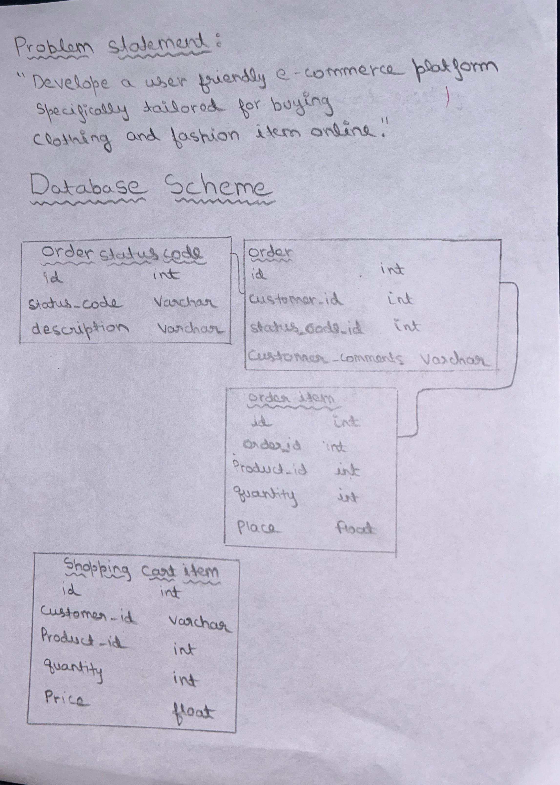
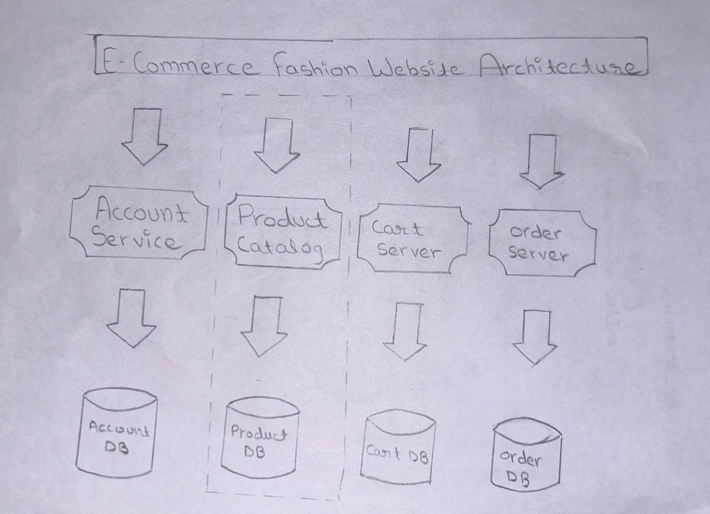

# E-Commerce Project

<h3><a href="https://whyhimanshu.github.io/Codespace/home.html">Vintique</a> - where Vintage Meets Unique</h3>

Welcome to Vintique, where vintage meets unique! This project is an online unisex fashion page developed by Dev Dynasty, created during a webathon organized in ABES Engineering College by Scholarhat on February 10, 2024.

<h3>Project Overview</h3>

Vintique aims to provide a user-friendly e-commerce platform specifically for buying clothing and fashion items for unisex individuals. Our mission is to offer a seamless shopping experience that blends the charm of vintage fashion with modern uniqueness.

<h3>Problem Statement</h3>

The problem statement for our project is to develop a user-friendly e-commerce platform specifically for buying clothing and fashion items for unisex individuals.

<h3>Project Progress</h3>

As of now, we have completed the frontend part of our project. We have designed and implemented the user interface to ensure a visually appealing and intuitive browsing experience for our users.

<h3>Backend Development Goals</h3>

Our next steps involve enhancing the backend functionalities of our platform. We plan to implement the following features:

1. <h4>Order Status:</h4> Implementing a system to track and display the status of orders placed by users.
2. <h4>Shopping Cart:</h4> Developing a shopping cart functionality to allow users to add, remove, and manage items before checkout.
3. <h4>Secure Payment Gateway:</h4> Integrating a secure payment gateway to facilitate safe and convenient transactions for our users.

<h3>Database Schema and Website Architecture</h3>

We have attached the database schema and website architecture documents for reference. These resources outline the structure and organization of our data as well as the overall layout and navigation flow of our website.
 

 

<h3>Responsive Design</h3>

We are proud to announce that we have made significant progress in achieving responsiveness across various devices and screen sizes. Our website adapts seamlessly to different resolutions, ensuring an optimal viewing experience for all users.

<h3>Get Involved</h3>

We welcome feedback, suggestions, and contributions from the community to further improve and refine our platform. If you're interested in collaborating with us or have any inquiries, feel free to reach out to our team at [explore.himanshu@gmail.com](mailto:explore.himanshu@gmail.com).

Thank you for your interest in Vintique - where vintage meets unique!

*Dev Dynasty Team*
